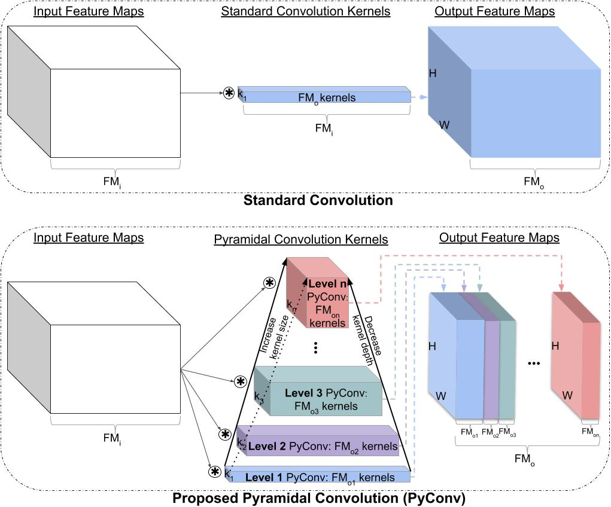

## Pyramidal Convolution



This is a PyTorch implementation of ["Pyramidal Convolution: Rethinking Convolutional Neural Networks for Visual Recognition"](https://arxiv.org/pdf/2006.11538.pdf) paper:
```
@article{duta2020pyramidal,
  author  = {Ionut Cosmin Duta and Li Liu and Fan Zhu and Ling Shao},
  title   = {Pyramidal Convolution: Rethinking Convolutional Neural Networks for Visual Recognition},
  journal = {arXiv preprint arXiv:2006.11538},
  year    = {2020},
}
```

The models trained on ImageNet can be found [here](https://drive.google.com/drive/folders/1DGTXansI_JbxJsS0cQzvfrLEVdJ6l8Oh?usp=sharing).


PyConv is able to provide improved recognition capabilities over the baseline
(see [the paper](https://arxiv.org/pdf/2006.11538.pdf) for details).

The accuracy on ImageNet (using the default training settings):


| Network | 50-layers |101-layers |152-layers |
| :----- | :-----: | :-----: |:-----: |
| ResNet  | 76.12% ([model](https://drive.google.com/uc?export=download&id=176TS0b6O0NALBbfzpz4mM1b47s4dwSVH)) | 78.00% ([model](https://drive.google.com/uc?export=download&id=1bermctRPLs5DIsHB0c4iDIGHvjfERPLG)) | 78.45% ([model](https://drive.google.com/uc?export=download&id=1FAggTH4m7Kec8MyRe8dx-ugI_yh-nLzL))|
| PyConvHGResNet  | **78.48**% ([model](https://drive.google.com/uc?export=download&id=14x0uss32ASXr4FJTE7pip004XZpwNrZe))| **79.22**% ([model](https://drive.google.com/uc?export=download&id=1Fm48GfOfn2Ivf5nBiR1SMhp66k67ePRh))| **79.36**% ([model](https://drive.google.com/uc?export=download&id=1LRmdQWTceDkepnIxZ2mWbpEE2lFxy0QO))|
| PyConvResNet  | **77.88**% ([model](https://drive.google.com/uc?export=download&id=128iMzBnHQSPNehgb8nUF5cJyKBIB7do5))| **79.01**% ([model](https://drive.google.com/uc?export=download&id=1fn0eKdtGG7HA30O5SJ1XrmGR_FsQxTb1))| **79.52**% ([model](https://drive.google.com/uc?export=download&id=1zR6HOTaHB0t15n6Nh12adX86AhBMo46m))|


The accuracy on ImageNet can be significantly improved using more complex training settings (for instance, using additional data augmentation (CutMix), increase bach size to 1024, learning rate of 0.4, 300 epochs and use mixed precision to speed-up training):


| Network | test crop: 224×224 | test crop: 320×320 | |
| :----- | :-----: | :-----: |:-----: |
PyConvResNet-50 (+augment) |  79.44 | 80.59| ([model](https://drive.google.com/uc?export=download&id=19RFyaDnJ34IeqwS8QOX29JWH9I0r_ewM))|
PyConvResNet-101 (+augment) |  80.58 | 81.49| ([model](https://drive.google.com/uc?export=download&id=12PXOwgIF4eiApxDL5QrAMnjbiX69YQOi))|


### Requirements

Install PyTorch and ImageNet dataset following the [official PyTorch ImageNet training code](https://github.com/pytorch/examples/tree/master/imagenet).

A fast alternative (without the need to install PyTorch and other deep learning libraries) is to use [NVIDIA-Docker](https://docs.nvidia.com/deeplearning/frameworks/pytorch-release-notes/pullcontainer.html#pullcontainer), 
we used [this container image](https://docs.nvidia.com/deeplearning/frameworks/pytorch-release-notes/rel_19-05.html#rel_19-05).


### Training
To train a model (for instance, PyConvResNet with 50 layers) using DataParallel run `main.py`; 
you need also to provide `result_path` (the directory path where to save the results
 and logs) and the `--data` (the path to the ImageNet dataset): 
```bash
result_path=/your/path/to/save/results/and/logs/
mkdir -p ${result_path}
python main.py \
--data /your/path/to/ImageNet/dataset/ \
--result_path ${result_path} \
--arch pyconvresnet \
--model_depth 50
```
To train using Multi-processing Distributed Data Parallel Training follow the instructions in the 
[official PyTorch ImageNet training code](https://github.com/pytorch/examples/tree/master/imagenet).

